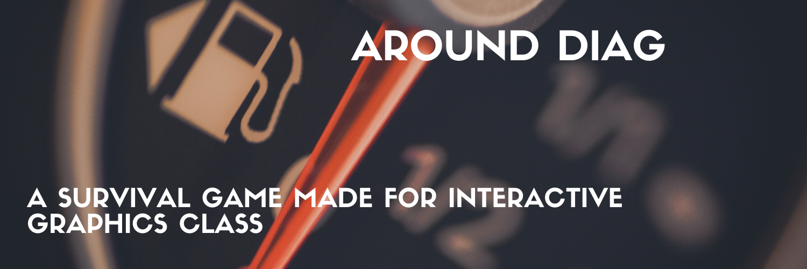

# AroundDIAG



AroundDIAG is a simple game where you run against time to collect fuels in order to survive. This project is designed and impelement for the solely purpose of Interactive Graphics course that is offered in Sapienza, University of Rome in 2020 by Marco Schaerf. 

### Running

You can start playing by cloning the repository and then just opening the index.html.
```sh
$ git clone repo
```

### Components
- Buildings
- Trees
- Fuel
- House
- Cars
- Pole/Street light
- Traffic light
- Trash bins
- Roads
- Parking lot

### Features 
- Night/Day Cycle
- Rain/Snow 
- Car engine sound 
- Car horn sound 
- Back lights 
- Police Car lights

### Todos

 - xx
